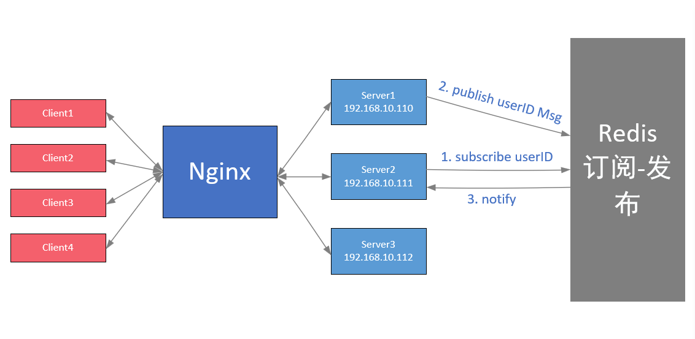

# ClusterChatServer
基于Muduo实现的负载均衡聊天服务器

---
> 开发环境以及相关工具
- Ubuntu：20.04
- Nginx：1.12.2
- Redis：5.0.7
- Mysql：8.0.39
- Muduo：https://github.com/chenshuo/muduo
- Json库：https://github.com/nlohmann/json
---
> 整体架构



---
> 项目结构
```
├── bin       // 编译之后的二进制文件
├── build     // CMake生成的中间文件
├── include   // 头文件
│   ├── public.hpp
│   └── server
│       ├── chatserver.hpp
│       ├── chatservice.hpp
│       ├── db
│       │   └── db.h
│       ├── model         // ORM对象以及数据操作接口
│       │   ├── friendmodel.hpp
│       │   ├── group.hpp
│       │   ├── groupmodel.hpp
│       │   ├── groupuser.hpp
│       │   ├── offlinemessagemodel.hpp
│       │   ├── user.hpp
│       │   └── usermodel.hpp
│       └── redis
│           └── redis.hpp
|
├── src    //源码
|   ├── CMakeLists.txt       
│   ├── client          // 客户端源码
│   │   ├── CMakeLists.txt
│   │   └── main.cpp
│   └── server         // 服务端源码
│       ├── chatserver.cpp
│       ├── chatservice.cpp
│       ├── CMakeLists.txt
│       ├── db
│       │   └── db.cpp
│       ├── main.cpp
│       ├── model
│       │   ├── friendmoel.cpp
│       │   ├── groupmodel.cpp
│       │   ├── offlinemessagemodel.cpp
│       │   └── usermodel.cpp
│       └── redis
│           └── redis.cpp
├── test              // json库和Muduo库测试文件
│   ├── testjson
│   │   ├── json.hpp
│   │   ├── testjson
│   │   └── testjson.cpp
│   └── testmuduo
│       ├── CMakeLists.txt
│       └── muduo_server.cpp
└── thirdparty      // 第三方json解析及编码器
|    └── json.hpp
├── CMakeLists.txt 
├── README.md
```
---
> 编译
1. cd build
2. cmake ..
3. make
---
> 运行
0. 确保Mysql，Redis，nginx已启动；确保已建立数据库且插入数据
    - sudo netstat -tanp
1. 启动服务器
    - ./bin/ChatServer 127.0.0.1 6000
    - ./bin/ChatServer 127.0.0.1 6002
2. 启动客户端
    - ./bin/ChatClient 127.0.0.1 8000
    - ./bin/ChatClient 127.0.0.1 8000
3. 在客户端终端发送消息，观察服务端终端反馈